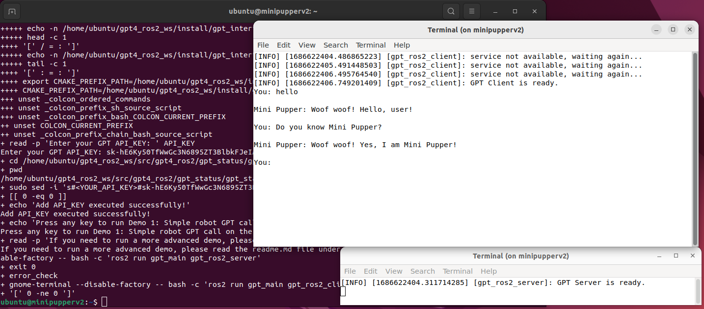

# RailBot: An easy way to get started with robotics and multimodal models

# Overview

The purpose of RailBot is to enable anyone write and package code that can be run on real robots, with a focus on integrating cloud LLMs with embedded code and models for the purposes of learning and entertainment.

I want this code to be as accessible as possible. I would love to get feedback on making setup simpler and more robust across as many developer environments as possible. I want to make it possible to become a robotics expert without ever needing anything more than a cheap Linux, Windows or Mac computer.

I am gradually trying to generalize this code as well as introduce more sophisticated integration between LLMs, multimodal, vision and audio models (TTS/STT). My goal is to find ways to manage the trade-offs between on-device, on-premise and cloud computing to maximise the utility of these robots without requiring radical new technologies or approaches.

One way to think about it might be "LangChain for robots" - a place where people can quickly implement new techniques and get feedback on them.

- stt using https://platform.openai.com/docs/guides/speech-to-text
- tts using https://platform.openai.com/docs/guides/text-to-speech

Later, on-device audio:
- stt using https://github.com/ros-ai/ros2_whisper?
- tts using https://github.com/rhasspy/piper

Also, video / photos:
- OpenCV + Oak D-Lite samples
- integration with multi-modal LLMs like Gemini and GPT-4 Turbo

Also, motion:
- navigation and interaction using LLM function calling

# Summary

How it works on my Mini Pupper 2:

your voice ---> Mini Pupper 2 record by Mic x2 ---> translate voice to text by OpenAI STT service ---> chatGPT API ---> translate text to voice by OpenAI TTS service ---> Mini Pupper 2 voice Playback & Movement & emotion.

# Installation

## Installing ROS 2 on MacOS (may work on Linux too)

### Setup Environment

We assume a working micromamba environment. On macOS, make sure you install [Xcode](https://apps.apple.com/app/xcode/id497799835).

On macOS with homebrew, you can get `micromamba` by running `brew install micromamba`.

The `setup.sh` script does the following:
 * creates the `railbot` micromamba environment with desired package channels and versions (ROS 2 Humble, nodejs, cmake, colcon, rosdep, etc)
  * `micromamba create -n railbot -c conda-forge -c robostack-staging -c robostack-experimental ros-humble-desktop rosdep nodejs==18.9.1 compilers cmake pkg-config make ninja colcon-common-extensions`
 * activates the `railbot` environment
  * `micromamba activate railbot`
 * installs packages specified in `requirements.txt`
  * `pip install -r requirements.txt`

```bash
. ./setup.sh
```

Also, might be useful, from the [ROS 2 MacOS docs](https://docs.ros.org/en/iron/Installation/Alternatives/macOS-Development-Setup.html#disable-system-integrity-protection-sip):

> macOS/OS X versions >=10.11 have System Integrity Protection enabled by default. So that SIP doesn’t prevent processes from inheriting dynamic linker environment variables, such as DYLD_LIBRARY_PATH, you’ll need to disable it following [these instructions](https://developer.apple.com/library/content/documentation/Security/Conceptual/System_Integrity_Protection_Guide/ConfiguringSystemIntegrityProtection/ConfiguringSystemIntegrityProtection.html).

Confirm that your environment is working by running rvis2:

```bash
rvis2
```

### Updating Packages

If you want to update packages later, run this:

```bash
micromamba update --all
```

### Running Commands

Before running ROS commands in a new shell, you need to run `micromamba activate railbot`. Once you've run that command, your environment should contain the base "underlay" for ROS:

```bash
$ env | grep ROS
ROS_DISTRO=humble
ROS_LOCALHOST_ONLY=0
ROS_PYTHON_VERSION=3
ROS_VERSION=2
ROS_OS_OVERRIDE=conda:osx
ROS_ETC_DIR=/Users/daniel/micromamba/envs/railbot/etc/ros
```

### Run `rvis2`

```bash
rviz2
```

### Run `ros2`

`ros2` is a command-line tool for ROS 2.

Here's a few examples:

```bash
ros2 wtf # list out of date packages and other possible issues
ros2 interface list # list interfaces (like IDL) for things like goals, sensor data, etc.
ros2 topic list # list topics that can be subscribed to which will emit or receive structured data
ros2 run demo_nodes_cpp talker # run a node that emits "Hello World {N}" messages
ros2 run demo_nodes_cpp listener # listen for messages from the previous node
```

### Run `rqt_graph`

Once you have some ROS 2 nodes running, you can visualize them using `rqt_graph`

```bash
rqt_graph
```

Try running this app, then running the `talker` example above, then click the "refresh" button. Then run the `listener` example and refresh again. You should see the nodes appearing and disappearing, including their topic subscriptions.

### Using JupyterROS

Adapted from https://github.com/RoboStack/jupyter-ros

JupyterROS allows you to prototype robotics applications from a familiar Python notebook interface, including
interactive 3D graphics, all in a web browser:

The following _may_ (TBC) be necessary in order to have the UI load properly:

```bash
jupyter nbextension install --py --symlink --sys-prefix jupyros
jupyter labextension install @jupyter-widgets/jupyterlab-manager
jupyter labextension install @jupyter-widgets/jupyterlab-sidecar

jupyter nbextension enable --py --sys-prefix jupyros
jupyter labextension enable @jupyter-widgets/jupyterlab-manager
jupyter labextension enable @jupyter-widgets/jupyterlab-sidecar
```

Now to launch:

```bash
jupyter-lab notebooks/ROS2_Keyboard_Input.ipynb
```

When you click in the small black square and press the arrow keys on your keyboard, you should see the icon change to reflect the pressed key. Scroll to the bottom and click "start" before interacting with the keyboard control.

Now try `ROS2_Turtlesim_KeyboardControl`. After clicking start, click on the smaller blue square and then scroll to view the turtle. Then you can use the arrow keys to turn and move the turtle forwards and backwards.

### Running VisualROS with Node RED

VisualROS is a way of creating ROS nodes visually in the browser. The Docker images don't work so we need to build against the OS in our micromanba environment.

Read more [here](https://github.com/eProsima/node-red-ros2-plugin).

```bash
npm install -g node-red

# also need this for compilation to work
# micromamba install -c conda-forge websocketpp
brew install websocketpp
# or, on Ubuntu: sudo apt install websocketpp-dev
```

Now we install the eProsima "integration service" in the ROS 2 workspace.

```bash
cd $RAILBOT_WS/src
git clone https://github.com/eProsima/Integration-Service.git is
git clone https://github.com/eProsima/WebSocket-SH.git
git clone https://github.com/eProsima/ROS2-SH.git
git clone https://github.com/eProsima/FIWARE-SH.git

# not necessary on macos?
# . /opt/ros/humble/setup.sh # customize the ROS2 distro: foxy, galactic, humble ...
cd $RAILBOT_WS
colcon build --symlink-install  --cmake-args -DIS_ROS2_SH_MODE=DYNAMIC -DPython3_FIND_VIRTUALENV=ONLY -Dwebsocketpp_DIR=/opt/homebrew/Cellar/websocketpp/0.8.2/lib/cmake/websocketpp/
```

Then initialize your workspace environment and run `integration-service` as a test:

```bash
. ./install/local_setup.zsh
```

Now we install the node-red plugin:

```bash
$ npm install -g node-red-ros2-plugin
```

And run node-red:

```bash
node-red
```

### Using with FoxGlove

TODO: can't make it work on macOS

FoxGlove is a development tool that can help visualize your robot. It requires installing a special [foxglove_bridge](https://github.com/foxglove/ros-foxglove-bridge) Ros node in your workspace.

```
cd <path/to/your/ros_ws>
git clone https://github.com/foxglove/ros-foxglove-bridge.git src/ros-foxglove-bridge
rosdep update # not necessary on macos?
rosdep install --ignore-src --default-yes --from-path src # might fail
colcon build --event-handlers console_direct+ --symlink-install --cmake-args  -DPython3_FIND_VIRTUALENV=ONLY
```

### Build the packages

> *NOTE:* rosdep may not be necessary/useful on macOS?

If you haven't done this yet, you'll need to initialize [rosdep](https://wiki.ros.org/rosdep). This is a command line tool for installing the system dependencies required by ROS packages.

```bash
rosdep init
rosdep update
```

Now, let's install the dependencies and then build the packages:

```bash
rosdep install --from-paths . --ignore-src -r -y # TODO: this might not be necessary
colcon build --symlink-install --cmake-args -DPython3_FIND_VIRTUALENV=ONLY
```

### Build a Workspace

In Ros 2, you run packages from a [Workspace](https://docs.ros.org/en/humble/Tutorials/Beginner-Client-Libraries/Creating-A-Workspace/Creating-A-Workspace.html), which is a specially-arranged directory that includes a shell script that you source before running the packages.

Your "underlay" is the ROS 2 installation (in our case, ROS 2 "[Humble](https://docs.ros.org/en/foxy/Releases/Release-Humble-Hawksbill.html)"). Note that MacOS is a "tier 3 platform" and so may be missing packages that are available on Linux or Windows.

The "underlay" for our workspace is the main setup.bash file for the ROS 2 installation.

```bash
# TODO THIS IS WRONG AND UNNECESSARY ON MACOS
# source /opt/ros/humble/setup.bash
```

Now you'll want to create your own workspace directory.

```bash
# change this to whatever you want, but don't forget to have it set in your
# shell when running any of these commands again.
RAILBOT_SOURCE=$(pwd)
RAILBOT_WS=~/workspace/robotics/railbot_ws

# make our workspace dir
mkdir -p $RAILBOT_WS/src
cd $RAILBOT_WS/src
```

On Linux you would run `rosdep` right now, but on MacOS we don't. We use `brew` and `conda` to install system-level dependencies instead.

Now let's symlink our source into the workspace.

```bash
ln -s $RAILBOT_SOURCE $RAILBOT_WS/src
```

And now let's build *from the root of our workspace* (otherwise packages will be built in whatever directory you're in):

```bash
cd $RAILBOT_WS
colcon build --symlink-install --cmake-args -DPython3_FIND_VIRTUALENV=ONLY
```

Some useful arguments for `colcon build`:

 * `--symlink-install` saves you from having to rebuild every time you tweak python scripts
 * `--cmake-args -DPython3_FIND_VIRTUALENV=ONLY` helps avoid errors if using micromamba on macOS, and possibly other platforms.
 * `--packages-up-to` builds the package you want, plus all its dependencies, but not the whole workspace (saves time)
 * `--event-handlers` console_direct+ shows console output while building (can otherwise be found in the log directory)

Now running `ls` in the current dir should show some additional directories alongside `railbot`:

```bash
% ls
build	install	log	src
```

### Running a simple text chat example

Now we can source our generated "overlay":

```bash
source ./install/local_setup.sh
```

And now we can run it:

```bash
% pip install openai
% OPENAI_API_KEY="sk-..." ros2 run gpt_main gpt_ros2_server
[INFO] [1702827350.339493666] [gpt_ros2_server]: GPT Server is ready.
```

And the client:

```bash
% ros2 run gpt_main gpt_ros2_client
[INFO] [1702828717.243596012] [gpt_ros2_client]: GPT Client is ready.
You: What is your name?

Mini Pupper: My name is Mini Pupper. Woof!
```

### Running an audio chat example

```bash
source ./install/local_setup.sh
OPENAI_API_KEY="sk-..." ros2 launch gpt_bringup gpt_bringup_launch.py mini_pupper:=False
```

Now when you see `Starting audio recording...` try saying a few words. After capturing a few seconds of audio, it sends it to OpenAI to be converted into text. Then, it sends the Text to the Chat Completions endpoint to compute a response. Finally, it converts the response text back into speech using _another_ API. No wonder it takes so long to reply!

Here's some example output:

```
[audio_output-3] [INFO] [1702829135.556824870] [gpt.audio_output]: Text to speech node successfully initialized.
[gpt_service-2] [INFO] [1702829135.556989663] [gpt.gpt_service]: GPT node is ready.
[audio_output-3] [INFO] [1702829135.557156831] [gpt.audio_output]: Waiting for text to speech input...
[audio_input-4] [INFO] [1702829135.741494108] [gpt.audio_input]: Audio input successfully initialized.
[audio_input-4] [INFO] [1702829137.701167975] [gpt.audio_input]: Starting audio recording...
[audio_input-4] [INFO] [1702829144.885283700] [gpt.audio_input]: Audio recording complete!
[audio_input-4] Set parameter successful
[gpt_param_server-1] [INFO] [1702829145.691914830] [gpt.gpt_param_server]: GPT status: "SPEECH_TO_TEXT_PROCESSING"
[audio_input-4] [INFO] [1702829150.759706228] [gpt.audio_input]: Audio Input Node publishing:
[audio_input-4] 'This is a test.'
[gpt_service-2] [INFO] [1702829150.760200314] [gpt.gpt_service]: GPT node has received: This is a test.
[gpt_service-2] Set parameter successful
[gpt_param_server-1] [INFO] [1702829151.670866539] [gpt.gpt_param_server]: GPT status: "GPT_PROCESSING"
[gpt_service-2] [INFO] [1702829151.776636563] [gpt.gpt_service]: GPT node is processing: This is a test.
[gpt_service-2] [INFO] [1702829151.777072858] [gpt.gpt_service]: user_input_processor has finished.
[gpt_service-2] [INFO] [1702829152.709136356] [gpt.gpt_service]: generate_chat_completion has finished.
[gpt_service-2] [INFO] [1702829152.709641359] [gpt.gpt_service]: get_chat_response_text has finished.
[gpt_service-2] [INFO] [1702829152.710320656] [gpt.gpt_service]: GPT service node has published: std_msgs.msg.String(data='Woof! Hello, how can Mini Pupper help you today?')
[audio_output-3] [INFO] [1702829152.712106585] [gpt.audio_output]: Received text: 'Woof! Hello, how can Mini Pupper help you today?'
[audio_output-3] Set parameter successful
[gpt_param_server-1] [INFO] [1702829153.667098451] [gpt.gpt_param_server]: GPT status: "TEXT_TO_SPEECH_PROCESSING"
[audio_output-3] Set parameter successful
[gpt_param_server-1] [INFO] [1702829156.168938990] [gpt.gpt_param_server]: GPT status: "ROBOT_ACTION"
[audio_output-3] [ffmpeg/demuxer] mp3: Estimating duration from bitrate, this may be inaccurate
[audio_output-3]  (+) Audio --aid=1 (mp3 1ch 24000Hz)
[audio_output-3] AO: [coreaudio] 24000Hz mono 1ch floatp
[audio_output-3] A: -00:00:00 / 00:00:02 (0%)
[audio_output-3] A: 00:00:00 / 00:00:02 (1%)
```

### Running a Whisper example

This actually downloads and uses https://github.com/ros-ai/ros2_whisper from inside our workspace. I haven't integrated this yet.

Build:

```bash
pip install pyaudio
cd $RAILBOT_WS/src
git clone https://github.com/ros-ai/ros2_whisper.git
cd ../
# for CUDA-equipped machines, you can specify WHISPER_CUBLAS=On
colcon build --symlink-install --cmake-args -DWHISPER_CUBLAS=Off -DPython3_FIND_VIRTUALENV=ONLY
```

Now we can run it. Note that the first time this runs it will download a model into

```bash
ros2 launch whisper_bringup bringup.launch.py n_thread:=4
```

Once the server is running, in another terminal:

```bash
pip install pynput # only need this the first time, obviously
ros2 run whisper_demos whisper_on_key
```

Note to self: customizing the model to use actually requires more than just modifying config.yaml. Turns out it's maybe kinda ignoring the YAML file?

Instead modify model name in `inference_node.cpp`:

```cpp
// whisper parameters
node_ptr_->declare_parameter("model_name", "medium.en"); // was base.en
```

Or maybe (TBD) the choices in whisper_server_mixin.py

# STOP HERE

The docs below this point need to be updated for the micromamba/conda-ish approach described above, which works on a mac but might need tweaking for Linux and certainly Windows.

## Simulated Mode

To install standalone on a PC you'll need WSL 2 with Ubuntu 20.04 LTS, or actual Ubuntu.

```bash
# make a wordspace directory for building our ROS2 package
cd ~
mkdir -p railbot_ros2_ws/src
cd railbot_ros2_ws/src

# check out the code
git clone git@github.com:Gravity-Rail/railbot
cd railbot

# install Python dependencies for Linux
. dependencies_install.sh

# install ROS dependencies
cd ~/railbot_ros2_ws
rosdep install --from-paths src --ignore-src -r -y

# build the package
source /opt/ros/humble/setup.bash
colcon build --symlink-install
```

Modify your ~/.bashrc to include the following lines:

```bash
. $HOME/railbot_ros2_ws/install/setup.bash
export OPENAI_API_KEY="..."
```

Then, to run it:

```bash
bash -c 'ros2 run gpt_main gpt_ros2_server'
```

In another terminal:

```bash
bash -c 'ros2 run gpt_main gpt_ros2_client'
```

## One-click Installation

Mini Pupper 2 and Ubuntu 22.04 + ROS 2 Humble is required. Please follow the installation document [here](https://github.com/mangdangroboticsclub/mini_pupper_ros )

To install with one command, connect to your Mini Pupper 2, be certain to tell ssh to allow X11 forwarding if you want to run demo 1.

```bash
ssh -o ForwardX11=yes ubuntu@<Your Mini Pupper 2 IP address>
```

and then run the following command:

```bash
wget -O $HOME/install.sh https://raw.githubusercontent.com/Gravity-Rail/railbot/main/install.sh && sudo chmod +x $HOME/install.sh && bash $HOME/install.sh && rm $HOME/install.sh
```

After the one-click Installation, `demo 1 Simple robot GPT call on the PC side` will run automatically, if you want to run other demos, please modify the configuration file according to Step4 of Manual Installation




## Manual Installation

If you want to install manually, follow the steps below.

### Step 1: Clone the repo

```bash
cd <your_ws>/src
git clone https://github.com/Gravity-Rail/railbot.git
```

### Step 2: Install dependencies

```bash
cd <your_ws>/src/gpt4-turbo-minipupper2-ros2-humble
sudo chmod +x dependencies_install.sh
. dependencies_install.sh # Install dependencies
```

### Step 3: Build the repo

```bash
cd <your_ws>
rosdep install --from-paths src --ignore-src -r -y
colcon build --symlink-install
```

### Step 4: Configuration

To use the gpt4_ros2 package, follow these steps:

#### 4.2 Set up OpenAI API
1. Create an account on [OpenAI](https://platform.openai.com).
2. Click on the user icon in the upper-right corner.
3. Click `View API keys`.
4. Click `Create new secret key`.
5. Enter a `name` and click `Create secret key`.
6. Copy your secret key and save it securely.

#### 4.3 Configure and build the package
1. Navigate to `<your_ws>/src/gpt4-turbo-minipupper2-ros2-humble/gpt_status/gpt_status/gpt_config.py`.
```bash
cd <your_ws>/src/gpt4-turbo-minipupper2-ros2-humble/gpt_status/gpt_status
```
2. Set your desired configurations, such as the GPT-4 or GPT-3.5-turbo model, system_prompt, and other attributes. Fill in the relevant configuration details for OpenAI that you obtained earlier.
```bash
sudo nano gpt_config.py
```

#### 4.4 Modify the gpt_robot package code [optional]
If you wish to use GPT for your own robots, modify the contents of the gpt_robot package, which configures physical or virtual robots.

We encourage you to customize the GPTConfig class to tailor the functionality of this ROS2 wrapper for GPT-4 and ChatGPT (GPT-3.5) according to your specific needs. To do this, simply modify the values in the code snippet to suit your requirements:

GPT-4 is currently in a limited beta and only accessible to those who have been granted access. Please join the [waitlist](https://openai.com/waitlist/gpt-4-api) to get access when capacity is available.

Feel free to adjust the parameters, such as temperature, max_tokens, and top_p, to influence the behavior of the GPT model. You can also customize the system_prompt and user_prompt strings to create unique and engaging interactions with your robot.

By personalizing these settings, you can create a one-of-a-kind experience tailored to your specific robotic application. Enjoy experimenting and discovering new possibilities!


# Usage

## Demo 1: Simple GPT call on the PC

If you want to simply try this service, configure your OpenAI API and system_prompt in `gpt_status/gpt_config.py`. Then, try:

```bash
# Terminal 1
ros2 run gpt_main gpt_ros2_server
```

```bash
# Terminal 2
ros2 run gpt_main gpt_ros2_client
```

## Demo 2: GPT service on Mini Pupper 2

After configuring everything, run the below commands on Mini Pupper 2:
```bash
# Terminal 1 Bringup mini pupper
. ~/ros2_ws/install/setup.bash
ros2 launch mini_pupper_bringup bringup.launch.py
```
```bash
# Terminal 2 Bringup GPT
ros2 launch gpt_bringup gpt_bringup_launch.py mini_pupper:=True
```

# License
This project is licensed under the Apache-2.0 License.
```
Copyright 2023 Mangdang
Licensed under the Apache License, Version 2.0 (the "License");
you may not use this file except in compliance with the License.
You may obtain a copy of the License at
    http://www.apache.org/licenses/LICENSE-2.0
Unless required by applicable law or agreed to in writing, software
distributed under the License is distributed on an "AS IS" BASIS,
WITHOUT WARRANTIES OR CONDITIONS OF ANY KIND, either express or implied.
See the License for the specific language governing permissions and
limitations under the License.
```

ROS2 Humble modules originally forked from [MangDang Robotics Club example for the Mini Pupper 2](https://github.com/mangdangroboticsclub/chatgpt-minipupper2-ros2-humble).